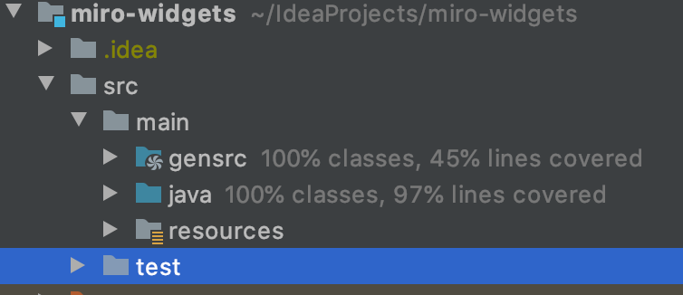
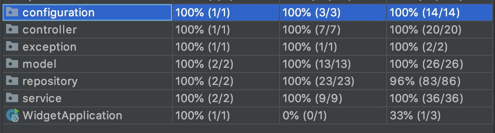

## Solution

### Chosen technologies
- Java 11
- SpringBoot
- JUnit
- Swagger
- H2

### Application

Type of the storage can be changed in application.properties `app.storage.type`.  
Valid values: `inmemory` and `jpa`.

### Testing
`mvn clean test`

### Running
`mvn clean package` - this will run tests and create jar file  
then `java -jar target/miro-widgets-1.0-SNAPSHOT.jar`

To access API Swagger was set up.  
Url is http://localhost:8080/api/swagger-ui.html (when running the service)

###Complications

- configurable datastore - DONE
- pagination - DONE
- rate limiting probably can be done with https://github.com/MarcGiffing/bucket4j-spring-boot-starter
